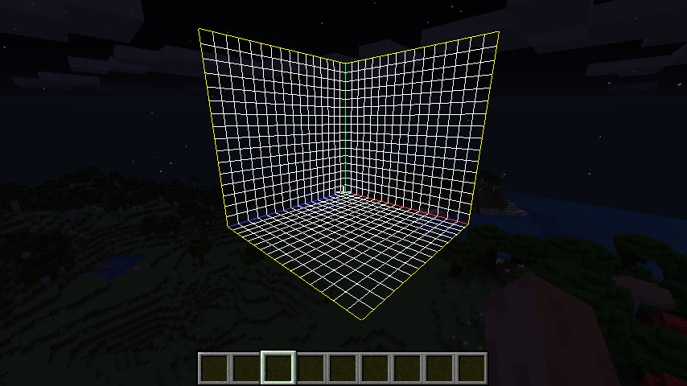
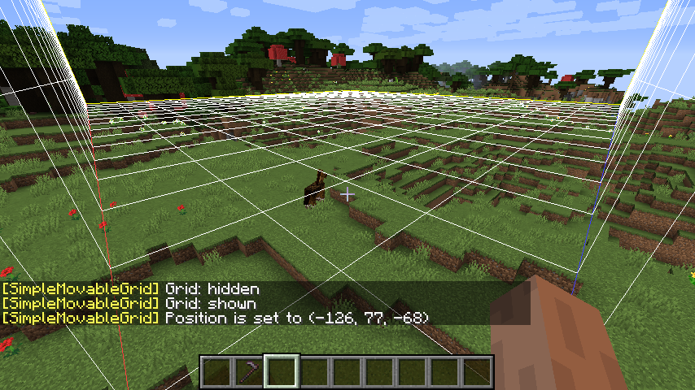

# Simple Movable Grid 

Adds a simple movable grid on client

## Requirements

### Forge Version

- Minecraft Forge

### Fabric Version

- Fabric Loader
- Fabric API
- Cloth Config
- Mod Menu

## How to Get Started

1. Open the screen of control settings in Minecraft (`Options...` -> `Contlorls...`)
2. Bind the hotkeys of `Toggle Grid` and `Set Position`
3. In a world, press `Set Position` key to set the base position of the grid lines to the coordinates at your feet

- `Toggle Grid` key switches the visibility of the grid lines
- You can open the config screen of this mod from in-game mod list (Fabric version requires Cloth Config and Mod Menu)

## License

- MIT license

----
Copyright © 2021 Iunius118
